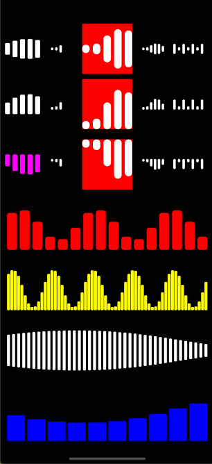

# SoundWaveAnimation
音波律动动画 


# Usage

```swift
let view = SoundWaveAnimationView(frame: CGRect(x: 10, y: 80, width: 70, height: 40))
view.waveCount = 5
view.animationType = .center
view.waveWidth = 10
view.waveHeight = 40
view.waveDuration = 0.5
view.instanceDelay = 0.1
self.view.addSubview(view)
view.startAnimation()

```

***PS:*** 音波间距是根据`SoundWaveAnimationView `视图总宽度计算得来，所以需要设置合适的宽度


# Example

